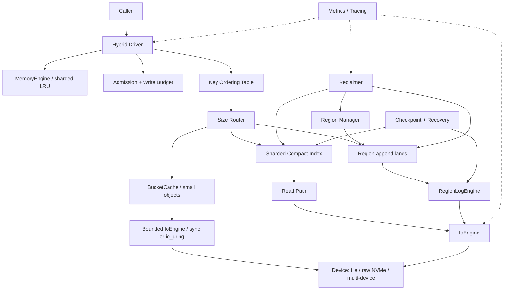
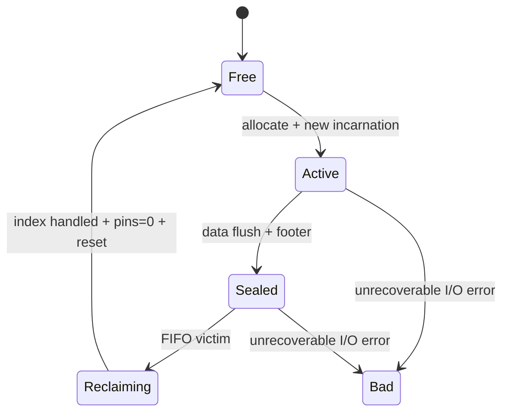

# cache-rs：面向 NVMe SSD 的 Hybrid Cache Engine 设计

状态：v1.1 单设备 large-scale Hybrid source-complete production candidate；全局
session manifest、统一 policy、有界 write-back/Async、Bucket/Region NVMe 数据路径和运维面均已
实现。目标 NVMe 性能、TB 级恢复、命中率/DWPD、24--72 小时 soak、canary 与真实掉电仍需部署
环境 sign-off

本文设计一个嵌入式、单进程独占、面向 Linux NVMe SSD 的 Rust hybrid cache engine。
它由有界 DRAM L1 与大小对象分流的 SSD L2 组成；它是可丢失、可重建的缓存，不是数据库，
也不承担源数据持久化职责。

当前实现进度（2026-08-23）：M0 API/正确性、M1 崩溃协议、M2 有界资源、M3
并发核心、M4 异步 I/O、M5 NVMe 数据路径、M6 快速恢复、M7 命中率/SSD 治理和
M8 生产化代码已按序完成。v1.1 进一步完成单盘大容量/大 entry 数量 RegionLog，以及
Memory/Bucket/Region 的完整 Hybrid 组合。该大对象数据路径是单普通文件、固定 Region、可选 FIFO 或
有界 second-chance 循环复用、最多 4096 shard、最多 268,435,456 个 32-byte 紧凑 index slot 和
256 个 mutation key-ordering stripe；包含 CRC32C、TTL、tombstone、`clear`、双 superblock，
以及 data extent 后的双槽 index checkpoint。clean 启动装载与 Superblock 严格配对的
checkpoint；dirty 启动从该基线只扫描变化的 Region incarnation/tail。`get` 不持有 key-ordering
锁，通过目标 Region 独立 read guard 并复核 epoch、location、seqno 和 incarnation；Region
reuse 只等待 victim Region 的 reader，不暂停其他 Region 的读取。

v1.1 默认使用一个、最多使用八个 hash-selected append lane，每个 lane 独占 Active
Region，并把已排队 put 合并为最多 64 records / 128 KiB 的连续 write。运行时 I/O
使用 owned-buffer `IoEngine`：同步 positioned-I/O worker pool 是默认/参考后端，Linux
`io_uring` 后端批量提交和回收 completion；两者都可使用独立 `O_DIRECT` data
descriptor。direct submission 的 buffer、offset、length 必须全部 4 KiB 对齐；
metadata、recovery、旧 Format V1 非对齐 record 和 positive short completion 的非对齐
remainder 保留 buffered compatibility path。format 建立精确 extent，并在 64-bit
Linux 请求 `posix_fallocate`。Linux aligned buffer 使用
`MAP_SHARED | MAP_ANONYMOUS`，read/write slot 随配置扩展且各自最多 128，扩容时新旧
mapping 的瞬时重叠也计入 hard memory budget。checkpoint 保持 4 KiB 盘上对齐，并以
固定 256 KiB I/O window 流式处理，Region/recovery workspace 纳入预算。checkpoint v4
持久化 Active Region lane identity、源 index 布局和 entry physical slot；读取端兼容
v1/v2/v3，并保守重建旧 lane 映射。

M7 增加固定内存 `Always`/`SecondHit` admission、namespace 容量与写配额、Region
valid ratio、异步一次性 second chance、分类 host-write/WA/每日预算，以及由运维注入的
NVMe SMART 健康样本。M8 增加有界延迟/错误/状态事件、OpenMetrics（由 Prometheus 或
OpenTelemetry Collector Prometheus receiver 抓取）、启动/配置/健康诊断、origin-fill
rate+concurrency guard，以及 `cachectl inspect/verify/format/reset/diagnose`。多盘、FDP、
raw block device 和 SPDK 留到 v1.x。

Hybrid 在此之上组合三个组件：固定容量、按 hash 分片的 `MemoryEngine`；无逐 entry
DRAM index、整 bucket RMW 的小对象 `BucketCache`；以及统一生命周期、同 key ordering、
TTL promotion 和按完整 key+value 大小路由的 `HybridCache`。默认采用 memory-first
write-back：`put` 以进程内 version 发布 dirty L1，并通过有界 reserved demotion 在
eviction/flush/close 时落盘；显式 `WriteThrough` 保留 L2-first 行为。open 只持久化一次
session dirty fence，稳态 mutation 不写 route journal、也不做 durability sync。`flush`
写 clean lower/global checkpoint 后在恢复流量前重新挂 dirty fence，`close` 发布最终 clean
边界。dirty reopen 可以安全清空可丢失的 lower tier，异常退出允许最新缓存值变成 miss，
但不能复活旧 route。

L1 value 使用 `Arc` 共享不可变 allocation；`get_handle` 的 L1 hit 只复制 handle，兼容
`get`/`lookup` 在释放 shard lock 后才复制 payload。只有 compact-index/Bloom 明确证明 lower
不存在旧候选时，dirty victim 才允许 detached background eviction；worker 持有 fine-grained
latest-version fence 贯穿 persistence，不等待 coarse foreground ordering lock。queue pressure、
stale version 或 lower reject 可安全退化为 miss。有 lower 候选时仍同步 persistence，避免暴露旧值。

## 1. 结论

完整模型采用 `MemoryEngine + BucketCache + RegionLogEngine`。小对象进入固定 bucket，
大对象追加到固定大小 region；内存层缓存两类对象的热点 clean copy。v1.1 的
`RegionLogEngine` 仍可独立使用，并继续承担大容量、大对象和顺序合并写路径。

核心取舍如下：

- 以顺序、合并写为主，避免小随机写消耗 NVMe 寿命。
- mutation 按 key hash 分片排序；`get` 乐观读取并在返回前复核索引与 Region generation，避免把磁盘延迟放进 256 个共享串行域。
- 索引只保存 hash/tag 和位置；完整 key 保存在盘上并在读取时校验。hash 冲突最多造成 false eviction/miss，不能返回别的 key 的 value。
- standalone `DiskCache` 与显式 Hybrid write-through 的 `put` 在 lower 数据/索引发布后完成；默认 Hybrid write-back 的 `put` 可只发布 dirty L1。`flush`/`close` 是显式 clean restart 边界，并下发到设备持久化原语。
- 每次 `remove` 写 tombstone；恢复时按单调 `seqno` 选择最后一次操作，避免旧 value 复活。
- standalone `DiskCache` 的 `flush`/`clear`/`close` 按 payload → commit header → clean
  Superblock 顺序发布双槽 checkpoint，并支持 dirty-tail 恢复。Hybrid 仅由 `flush`/`close`
  发布匹配的 lower/global clean checkpoint；`clear` 保持 session dirty，异常重启允许空 cache。
  结构损坏时只能严格验证恢复或安全清空，不能返回未验证数据。
- Bucket 小对象 engine 已接入与 Region 共用的 bounded `IoEngine`、4 KiB aligned pool、
  bounded owned decode codec 和可选 `io_uring`/`O_DIRECT` 快路径；目标 NVMe 调优与硬件
  签核仍待完成。当前 decode 会逐 entry 分配 key/value，page-view 是后续优化。

这个选择吸收了 CacheLib Navy 的 DRAM cache + BigHash + BlockCache 分层，也采用了 Foyer
的可插拔 engine / I/O / device 思路。bounded eviction-only write-back 是 Hybrid 默认；
session dirty fence、进程内 version、reserved demotion 和统一 async driver 让普通 mutation
避开逐 key metadata durability，write-through 作为显式策略保留。

## 2. 目标与边界

### 2.1 目标

- Linux 上使用单块 NVMe SSD 承载的独占普通文件；多设备与 raw block device 留到后续。
- 单实例容量 100 GiB 到略低于 64 TiB。
- key 最大 64 KiB；value 典型范围 128 B 到 1 MiB，首版硬上限 16 MiB。
- 高并发 point `get`、`put`、`remove`，不支持 range scan。
- `O_DIRECT` + `io_uring` 为生产主路径，`pread`/`pwrite` 线程池作为兼容和测试路径。
- DRAM 使用量可预测且有硬上限；队列、buffer pool、索引都不得无界增长。
- 设备错误或缓存损坏时 fail open：返回 miss 或拒绝写入，不拖垮上游数据源。
- 暴露足够指标来衡量命中率、尾延迟、engine write amplification 和设备磨损预算。

### 2.2 非目标

- 不提供事务、range query、snapshot、MVCC 或跨 key 原子性。
- 不提供多进程/多节点共享写入、复制或共识。
- 不保证像数据库 WAL 一样的每次写入断电持久化。
- 不依赖 cache 中的数据完成源数据恢复。
- 首版不实现压缩、加密、FDP、SPDK 或 userspace NVMe driver；这些能力在接口上预留。

### 2.3 正确性底线

1. 进程存活期间，同一个 key 的成功操作按实际执行顺序线性化。
2. 成功返回的 `remove` 之后，后续 `get` 不能返回被删除的旧值。
3. hash 冲突、torn write、CRC 错误、region 重用和并发 reclaim 都不能导致“key A 返回 key B 的 value”。
4. 崩溃后允许丢失尚未经过 `flush` 的最近更新，但不能返回校验失败的数据。
5. cache engine 发生不可恢复错误时可以整体降级为 miss-only。

## 3. 总体架构



### 3.1 分层职责

| 层 | 责任 | 不负责 |
| --- | --- | --- |
| `Hybrid Driver` | API、生命周期、大小路由、TTL promotion、同 key ordering、错误降级 | 具体盘上布局 |
| `MemoryEngine` | 固定容量分片 LRU、absolute TTL、clean/dirty metadata | SSD persistence、跨 tier ordering |
| `BucketCache` | 固定 bucket、小对象 FIFO、Bloom、整页 CRC/RMW | 逐 entry DRAM index、大对象 |
| `KeyOrderingTable` | 同 key 的 get/put/remove 排序 | 全局串行化 |
| `RegionLogEngine` | 紧凑索引、append、读取、删除、reclaim、恢复 | 小对象 bucket 布局 |
| `IoEngine` | 对齐 I/O、队列深度、buffer 生命周期、完成通知 | 淘汰策略 |
| `Device` | 容量、offset 映射、文件/raw device、多盘分布 | key/value 语义 |
| `AdmissionPolicy` | 污染控制、写入预算、背压拒绝 | 强制等待无界队列 |

接口边界保持可插拔，但首版每层只提供一个默认实现，避免在尚无数据时过度抽象。

## 4. 对外 API 与语义

v0.6 同时保留直接的同步 API，并通过同一个 cache 实例创建共享的有界 async facade：

```rust
impl DiskCache {
    fn get(&self, key: &[u8]) -> Result<Option<Vec<u8>>>;
    fn put(&self, key: impl AsRef<[u8]>, value: impl AsRef<[u8]>, options: PutOptions)
        -> Result<PutOutcome>;
    fn async_handle(&self) -> Result<AsyncDiskCache>;
}

impl AsyncDiskCache {
    fn get(&self, key: impl AsRef<[u8]>) -> CacheFuture<Result<Option<Vec<u8>>>>;
    fn put(&self, key: impl AsRef<[u8]>, value: impl AsRef<[u8]>, options: PutOptions)
        -> CacheFuture<Result<PutOutcome>>;
    fn close(&self) -> AsyncCloseFuture;
}
```

`CacheFuture` 实现标准 `Future`，也提供无 executor 场景的阻塞 `wait()`。facade 在复制
输入前预留有界槽；调用者原始输入和返回的 `Vec` 仍属于调用者内存。未来若实际 profile
证明复制是瓶颈，再考虑 `bytes::Bytes` 或 pinned value handle，不在 M4 提前引入依赖。

语义约定：

- `put` future 只在对应 record write 成功、旧索引失效、新索引发布之后完成。
- `put` 完成不等于断电持久；调用者需要 `flush` 才能建立持久化 barrier。
- `get` 命中时从对齐 read buffer 中复制并返回自有 `Vec<u8>`；不能让普通调用者无限持有 engine buffer。
- `remove` 无论当前是否命中都追加 tombstone，写成功后删除内存索引，再返回调用时观察到的 `Removed`/`NotFound`。
- `clear` 递增全局 `namespace_epoch` 并持久化 superblock，不逐 key 写 tombstone。
- `close` 停止 admission，排空 async/append/I/O，发布 clean checkpoint，然后释放设备锁；无法 fence 的 active `io_uring` mutation 例外地保留锁并返回错误。
- 同一 cache 文件/raw device 只允许一个 writer；启动时获取 advisory lock，并校验 cache UUID。

## 5. 并发模型

### 5.1 Key ordering

v0.6 固定建立 256 个 ordering stripe：

```text
ordering_shard = hash64(key) & (256 - 1)
```

`put`、`remove`、second-chance reinsertion 等 mutation 持有对应 stripe 的 mutex，
保持同 key 发布顺序。`get` 不取得该锁：它先复制 generation-aware index entry，再持有
目标 Region 的 read guard 完成 positioned I/O，校验完整 key/CRC/incarnation，最后复核
index entry。并发 mutation 最多使这次读取返回旧值、新值或 miss，不能返回错误 key 的
value；mutation 完成后的后继读取满足新状态。

Region 使用独立 `RwLock<RegionMeta>`。rotation 只取得 victim 的 write guard，因此仅等待
该 Region 的在途 reader；其他 Region 的读 I/O 和不同 append lane 可以继续。ordering 表
固定占用内存，没有逐 key lock 生命周期管理。

### 5.2 全局序号

每个 mutation 在持有 ordering shard 后分配一个单调 `u64 seqno`。`seqno` 用于：

- 恢复时决定同一 hash 的最后一次操作；
- tombstone 覆盖旧 value；
- reclaim copy 和前台更新竞争时做 index compare-and-swap；
- checkpoint 标记覆盖范围。

运行时正确性主要由 ordering shard 保证，`seqno` 主要服务于崩溃恢复和后台任务。

### 5.3 Region pin

读路径从索引得到位置后必须 `try_pin(region_id, incarnation)`。region 状态进入 `Reclaiming` 后不再接受新 pin；reclaimer 只有在索引迁移/删除完成且现有 pin 归零后，才能重置和重用 region。

这样即使读 I/O 已提交，底层 offset 也不会在完成前被新数据覆盖。`try_pin` 失败时，读路径重新检查一次 index 后返回新位置或 miss；不能持有 ordering shard 等待 reclaimer，否则会和 reclaimer 的逐 key 排序形成死锁。

## 6. 盘上布局

所有整数采用 little-endian。顶层 Superblock、Region Header、record header 和 checkpoint
directory/slot header 都有 magic、format version 和 CRC；checkpoint payload entry 由带
CRC 的 slot header 统一保护。不能直接把 Rust struct `transmute` 到盘上，必须显式编码，
避免 padding 和版本兼容问题。

```text
+---------------------------+ 0
| Superblock A, 4 KiB       |
+---------------------------+
| Superblock B, 4 KiB       |
+---------------------------+
| Region 0, 32 MiB          |
+---------------------------+
| Region 1, 32 MiB          |
+---------------------------+
| ...                       |
+---------------------------+
| Format V1 data extent     | 8 KiB + region_count * region_size
+---------------------------+
| Checkpoint directory 4 KiB| compatible tail extension
+---------------------------+
| Checkpoint slot A         | 4 KiB header + streamed payload
+---------------------------+
| Checkpoint slot B         | 4 KiB header + streamed payload
+---------------------------+
```

Superblock、Region Header 和 record 的 Format V1 编码保持不变。M6 在原 data
extent 之后追加可识别的 checkpoint directory 和两个等长 slot；没有该 tail 的旧 V1
文件仍走严格全量 scan，旧 reader 则忽略 data extent 之后的字节。slot 大小在第一次
checkpoint 时按实际/配置 index 容量计算，可在需要容纳更多 entry 时安全重建整个 tail。
legacy golden fixture 首次由 v1.0 打开时，其既有 data extent 保持逐字节不变，只在末尾
追加 checkpoint extension。

### 6.1 Superblock

正常 clean checkpoint 按 generation 奇偶更新一个 Superblock；dirty marker 和 `clear`
barrier 将相同新 generation 写入两份，避免启动回退到已经失效的 clean 世代。启动选择
generation 最大且 CRC 有效的一份。主要字段：

- magic、format version；
- superblock generation、clean shutdown 标志；
- region 大小和数量；
- hash seed、当前 `namespace_epoch`、`epoch_start_seqno`、下一个 `seqno`；
- clean 标志与 header CRC32C。

Format V1 Superblock 不保存 checkpoint 指针。checkpoint commit header 自带 slot id、
generation、Superblock generation、epoch、epoch-start/max seqno、hash seed 和 data
extent 身份；启动时用这些字段与 Superblock 精确配对，而不是猜测“当前槽”。

若最高 generation 的 superblock 损坏，回退到另一份；两份都损坏则默认放弃缓存并重新格式化，不能猜测布局。

### 6.2 Region

默认 region 为 32 MiB，状态机为：



每个 region 包含：

- 4 KiB header：`region_id`、`incarnation`、writer lane、创建 seqno、CRC；
- 从前向后追加的 records；
- 最后 4 KiB footer：seal 后写入，包含有效 payload 长度、record 数、min/max seqno、CRC。

active region 崩溃时可能没有 footer。恢复扫描到第一个 header CRC 失败、record 越界或 `region_incarnation` 不匹配的位置即停止。region 重用时先写入更大的 incarnation；旧尾部即使未擦除也不会被重新识别。

### 6.3 Record

固定 64-byte record header：

| 字段 | 大小 | 说明 |
| --- | ---: | --- |
| magic / format / kind / codec / flags | 8 B | `Value`、`Tombstone` 或控制记录 |
| key_len | 4 B | key 最大 64 KiB |
| value_len / stored_len / record_len | 12 B | 原始、编码后、含 padding 长度 |
| region_incarnation | 4 B | 阻断重用 region 的旧尾部 |
| namespace_epoch | 4 B | `clear` 后忽略旧 epoch |
| seqno | 8 B | mutation 顺序 |
| key_hash64 | 8 B | 索引 tag，完整 key 仍在 payload |
| expires_at_unix_ms | 8 B | 0 表示不过期 |
| payload_crc32c | 4 B | key + stored value |
| header_crc32c | 4 B | header 自身，CRC 字段按 0 计算 |

随后是 key、stored value 和 32-byte padding。v0.6 的 direct append batch 把末尾补齐到
固定 4 KiB alignment，单个 record 不强制占满 4 KiB；batch 末尾的 padding 计入最后
一个 record 的 `record_len`。只有 buffer address、file offset 和 submission length
全部 4 KiB 对齐时才使用 direct fd。旧文件中的 32-byte-aligned record 仍可由 buffered
compatibility descriptor 读取；恢复扫描中不能出现无法解释的零洞。

value 默认不压缩。未来启用压缩时，先编码再 admission，CRC 覆盖编码后的 payload，读取后再校验原始长度。

## 7. 内存索引

实现使用固定容量、分片、open-addressing 的紧凑 hash table，不为每个 entry 单独分配堆内存。shard 数按 slot 容量选择 2 的幂、最多 4096，每个 shard 由独立 `RwLock` 保护。

逻辑 slot 为 32 B：

```text
tag/hash64       8 B
packed location  8 B
seqno            8 B
namespace id     4 B
policy flags     4 B
```

默认 32 MiB region 时，location 的 64 bits 可编码：

- 21 bits region id：最多 2M regions，即 64 TiB；
- 22 bits offset / 8：覆盖 32 MiB；
- 20 bits record length / 32：覆盖一个 32 MiB region；
- 1 bit tombstone location 标记。

`policy flags` 独立保存 second-chance pending/used 状态；`namespace id = 0`
保持 M0--M6 的 key identity 和盘上 record 表示，非零 namespace 使用明确的 key 前缀
codec。checkpoint v2/v3 的 index entry 同样为 32 B；v4 entry 为 40 B，增加 physical
slot；旧 checkpoint v1 的 24 B entry 解码为 namespace zero、flags zero。

open-addressing 的 empty/deleted 状态使用保留 tag 编码；原始 hash 命中保留值时做无损 remap。tombstone 不进入普通 read index。

表的目标 load factor 不超过 0.80，因此预算约为 40 B / live record。示例：1 TiB cache、平均 encoded record 16 KiB，约 6700 万 live records，索引约 2.5 GiB。当前 256 Mi-slot 上限在 80% load 下约支持 2.14 亿 live entries；更密集的小对象 workload 应按 namespace 拆分多个 engine，或在 profile 证明收益后引入独立小对象 engine，不能只按设备字节容量估算索引。

索引容量在 create 时固定。表满或 probe 上限耗尽时，允许替换冲突 slot：被替换对象变成逻辑垃圾，之后访问为 miss。缓存允许 false eviction，但不能无界扩容。

读取必须校验盘上完整 key。64-bit hash 冲突时可额外读一次，但不能返回错误 value。若 key 来自不可信租户，可选用持久化随机 seed 的 keyed hash；这属于防御性增强，不改变格式和发布路径。

## 8. 读写流程

### 8.1 `put`

1. 校验 key/value 大小、TTL 和 engine 状态。
2. 计算 hash，进入 ordering shard。
3. 执行 admission；队列满或写预算不足时立即返回 `Rejected`。
4. 分配 `seqno`，编码 record，送入由 hash 选择的 append lane。
5. appender 从已经排队的 put prefix 中选择最多 64 records、128 KiB 的 batch，并把它们
   合并到连续 buffer；单个超过 128 KiB 的 record 仍可独立提交。
6. `IoEngine` 仅把严格 4 KiB 对齐的 runtime data request 送往 direct fd，其余合法的
   Format V1 compatibility request 送往 buffered fd。
7. I/O 成功后，在索引中发布新 location，并把旧 location 计为 invalid bytes。
8. 释放 ordering shard，返回 `Stored`。

I/O 失败时不修改索引。已经写入但未发布的 record 是无害垃圾，reclaim 时会丢弃。

### 8.2 `get`

1. 计算 hash，进入 ordering shard。
2. 从 index 复制 location；不存在，或 entry seqno 小于当前 `epoch_start_seqno`，则 miss。
3. pin region，按设备 alignment 向下/向上取整 read range。
4. 校验 region incarnation、header CRC、payload CRC、hash、完整 key、TTL。
5. 设置 index 中的 one-bit hit 标记，释放 pin 和 ordering shard。
6. 返回 value；任一校验失败则 CAS 删除该 index entry 并返回 miss。

记录小于 4 KiB 时通常一次 I/O 即可完成。location 已保存 record length，大对象也不需要先读 header 再发第二次 I/O。

### 8.3 `remove`

1. 进入 ordering shard，检查 index；若 hash/tag 命中则读取并校验完整 key，记住调用时该 key 是否命中。
2. 无论当前 index 是否命中，都分配 `seqno` 并追加包含完整 key 的 tombstone；这可以覆盖一次 forced eviction 后仍留在盘上的旧 record。
3. tombstone 写成功后删除 index entry，并把已知旧 record 计为 invalid。
4. 根据步骤 1 的结果返回 `Removed` 或 `NotFound`。

tombstone 只用于恢复，不进入普通 read index。`remove` 是控制操作，使用预留的 append/buffer 配额，不受普通 admission 和写预算拒绝。若 index 已有同 hash 的更高 seqno，旧 tombstone 可直接丢弃；否则，后台仅在“除当前 victim 外所有非空 region 的最小 seqno 都大于该 tombstone seqno”时才能丢弃。在无法证明安全前，reclaim 必须为 tombstone 分配新 seqno 并继续携带它。

### 8.4 `clear`

`clear` 不扫描索引或写海量 tombstone。它先停止新操作，分配一个 barrier seqno，递增 `namespace_epoch`，把 barrier 保存为新的 `epoch_start_seqno`，再持久化 superblock。旧 index slots 因 seqno 小于 barrier 被逻辑清空，无需同步清零数 GiB 内存；旧 region 在后台按普通 reclaim 回收，slots 随后惰性覆盖。

## 9. Append 与 I/O

### 9.1 Append lanes

默认 1 个 append lane，可配置为 1–8；每个 lane 独占一个 Active Region 和一个有界
queue，put 由完整 key hash 稳定分流：

```text
lane = hash64(key) % append_lanes
```

worker 收到一个 put 后，只贪心收集此时已经排队且连续的 put。每次 write plan 同时受
以下硬上限约束：

- 最多 64 records；
- 多 record batch 最多 128 KiB；
- 不跨当前 Region 的剩余空间；
- 遇到第一个非 put append command 即停止合并。

当前实现不设置额外 batch-delay timer；低流量的单个 put 立即成为 one-record batch。
128 KiB 是 coalescing 上限，不是对象大小上限：单个更大的合法 record 仍可单独写入。
lane count 是 clean checkpoint 的布局属性，重开时必须匹配；默认 1、硬上限 8 是当前
直接参数，不做自动调参。

同步多 caller 与 async facade 都能驱动多个 lane。async ordinary mutation worker 数为
`min(write_submission_depth, append_lanes × 8, 64)`，使每个 append worker 能收集已排队
put 并合并写；`flush`、`clear`、close 通过 FIFO exclusive barrier 等待更早 mutation
完成，并在控制操作结束前阻止后续 mutation 穿透。

### 9.2 `IoEngine`

```rust
pub trait IoEngine: Send + Sync + 'static {
    fn submit(&self, operation: IoOperation) -> Result<IoRequest, SubmitError>;
    fn submit_wait(&self, operation: IoOperation) -> Result<IoRequest, SubmitError>;
    fn cancel(&self, request_id: RequestId) -> io::Result<bool>;
    fn shutdown(&self) -> io::Result<()>;
    fn queue_depth(&self) -> usize;
}
```

`IoOperation` 从 admission 到 target completion 独占一个 `IoBuffer`；失败、取消和
乱序 completion 都不能提前归还 lease。v0.6 提供两种实现：

- 参考实现使用 positioned `pread`/`pwrite`/`fsync` 和最多 4 个固定 worker；
- Linux 实现使用一个 `io_uring`，默认 queue depth 128，批量推送 SQE 并一次回收全部可用 CQE；
- 两者共享 Future/阻塞 completion、cancel、controlled admission wait、shutdown 和指标；
- queue depth 硬上限为 4096，command、registry、completion 与 buffer 生命周期全部有界；
- fatal 后只有 target CQE 才是 buffer release fence；无法 fence 的 read buffer 被隔离，无法 fence 的 write/flush 会保留 flock，禁止同 inode 重开。

两个后端共享 `Buffered`、`Auto` 和 `Direct` 文件策略，Format V1 完全兼容。
`Auto` 在 Linux 尝试打开独立 `O_DIRECT` descriptor，并仅在系统报告 capability
不可用时关闭 direct path；`Direct` 要求 descriptor 成功打开，而且 aligned direct
request 出错后不做 buffered retry。无论选择哪种模式，metadata、recovery、legacy
unaligned records 和 short-I/O 后的 unaligned remainder 都走 buffered descriptor；
因此 `Direct` 表示 direct capability/错误语义是 required，不表示所有 legacy bytes
都 direct。所有真正送入 direct fd 的 buffer address、offset 和 length 都严格按
4 KiB 对齐。fault-injectable `IoBackend` 继续作为同步参考后端的 device seam；
registered files/fixed buffers 仍是后续可选优化。

async read 在纯读取阶段可取消；若读取结果要求删除 dirty L1 expiry、compact Bucket
expiry/corruption 或退休 Region expiry/corruption，则先以 `TaskContext::try_commit` CAS
取得提交权。cancel 先赢返回 `Requested`，且不得发生 mutation/refund；commit 先赢后
cancel 返回 `TooLate`，请求必须继续完成 owner dirty fence、物理 rewrite/index retirement、
exact receipt 发布并返回真实结果。

### 9.3 多盘

多盘按完整 region 分布，不把单个 record 跨盘切片：

- region id 映射到一个 device；
- appender 按容量权重选择 device；
- 每盘有独立 ring、clean-region pool 和健康状态；
- 一块盘故障只丢失该盘上的 cache entries，健康盘继续服务；
- 首版不做 cache RAID，也不为可丢缓存支付复制成本。

## 10. Reclaim 与淘汰

`free_regions` 与 `sealed_regions` 是按 Region 数量有界的 FIFO `VecDeque`。format/recovery
建立队列，append rotation 只做队头 pop/push，不再为每次换区扫描全部 Region。

复用一个 victim 的直接路径如下：

1. 从 sealed FIFO 选择 victim，取得该 Region 的独占 read-view guard；只等待该 Region 的
   in-flight read。
2. 写入并 sync 新 incarnation header，使旧 offset 不可能再通过 incarnation 校验。
3. 顺序读取旧 Region 的 record header，以 `(hash, location, seqno)` compare-remove 对应
   物理 index slot；工作量是 O(victim records)，与总 index slots 无关。
4. 推进该 Region 的 generation floor，并以 per-Region counter 一次扣除残留逻辑 entry；
   generation 不匹配的旧 slot 后续插入时惰性复用。
5. 只有 victim header 损坏或 short read 时才执行全 index corruption fallback；
   `reclaim_records_scanned` 与 `reclaim_index_fallbacks` 使这条边界可观测。

`SecondChance` 在复用前仍只对经过完整 record/key/CRC 校验、index 精确指向且 hit bit 已置位
的 value 做一次异步 reinsertion。reinsertion 保留 key/value/TTL，分配新 seqno，并由同一
key-ordering stripe 与前台 mutation 排序；单 Region 的复制量上限为其 payload 的 25%。

后续可以增加 `InvalidRatioPicker` 或 segmented FIFO，但首版先用 FIFO + one-bit second chance。需要重点观测：

```text
engine_write_amplification = bytes_submitted_to_device / admitted_value_bytes
reclaim_amplification      = reclaim_bytes_written / admitted_value_bytes
```

若 reclaimer 跟不上，按顺序采取：增加 append lane 前先确认设备余量、降低 reinsertion
上限、收紧 admission。不能用无界 buffer 掩盖问题。

## 11. Admission 与 SSD 寿命

v1.1 的 admission 链按直接、有界的顺序执行：

1. 校验对象尺寸、TTL、lifecycle、queue/buffer 和全局 bytes/s write budget。
2. `AdmissionMode::Always` 保留兼容行为；`SecondHit` 使用固定 64 KiB 一字节近似
   frequency table，普通新对象第二次观察才进入，大于 1 MiB 的对象第三次才进入。
   每次观察衰减一个 counter，因此无需全表扫描或后台线程；已有 key 的更新绕过阈值。
3. `NamespaceConfig` 对命名空间执行 live encoded bytes 容量和 bytes/s token bucket；
   reservation 在 append 失败时回滚，恢复出的 over-quota 数据仍可读，但新写被拒绝。
4. UTC-day host-write budget 在 dirty marker 前按预期提交 bytes reservation；要跨进程形成
   硬限制，调用者必须从外部持久计数注入当天 baseline。metadata/正确性所需 tombstone
   不会在半次提交中被预算切断，但会被计数并暴露 exceeded 状态。
5. NVMe health 默认仅观测；明确选择 `RejectPutsOnCritical` 后，只拒绝新的 put，读、删、
   flush 和 close 不受影响。

host-write tracker 在 submission 时按 foreground record、reinsertion、reclaimer、forced
tombstone、metadata 和 checkpoint 分类计数，因为失败的 submission 也可能已到达设备。
`write_amplification_milli = submitted_host_bytes * 1000 / admitted_value_bytes`。运维将
设备 DWPD、容量与保留余量换算为 UTC-day host-write budget；源码无法替代设备厂商耐久
规格和目标 workload 的写放大实测。

容量与写入预算使用不同的物理口径。Bucket live capacity 按 aligned encoded entry
记账，而一次 mutation 的写入预算和 host-write submission 是完整固定页；Region live
capacity 使用 durable receipt 返回的实际 packed record length（包含真实 direct padding），
standalone batch 的每日预算使用最终 `plan.write_len`。Hybrid 前台先保守预留 aligned
record 和最多 4095 B direct tail，write-back dirty L1 保存这笔 exact pending charge，
demotion 后在 pending 仍覆盖期间用 receipt 原子结算新旧物理 identity，最后才退款。
managed foreground 不在 Region 重复 reservation；SecondChance 自主 reinsertion 则必须在
写前取得共享 namespace/daily budget，并计入 `Reinsertion` host-write class。
`daily_host_write_bytes` 表示实际 submission；`daily_budget_used_bytes` 和
`daily_budget_reserved_bytes` 表示 admission 状态，两者不可互相替代。

Bucket 的逻辑 TTL miss 不等于物理容量释放。未 compact 的 expired entry 在启动扫描和
运行时继续占 aligned entry quota；只有 managed get/remove/put 成功重写整页后返回的 exact
removal receipt 才退款。整页 cleanup 受 UTC-day host-write budget 约束，预算拒绝、提交前
取消和写失败都保持原 quota/Bloom。紧配额 TTL workload 必须预留 headroom，并监控持续
capacity rejection；有界 expiry scavenger 留作后续可用性优化。

SMART 由调用者针对实际 backing controller 采集并传给 `observe_nvme_health`，字段包含
`data_units_written`、critical warning、available spare/threshold、percentage used 和
media errors。media-error 增长在实例生命周期内锁存为 critical。普通文件无法可靠反查
唯一 NVMe controller，因此库不自行猜测设备映射。

可选 NVMe FDP 支持放在 `Device::write_at(..., PlacementClass)`：

- `Foreground`：普通新写入；
- `ReinsertedHot`：预期寿命更长的 second-chance 数据；
- `Metadata`：superblock/checkpoint。

FDP、discard/TRIM、polling I/O 都是设备相关优化。没有指标证明收益前，不应改变核心 engine 语义。

## 12. Checkpoint 与恢复

实现说明：M6 已实现本节协议，v1.1 writer 使用 checkpoint payload v4。checkpoint
是原 Format V1 data extent 之后的兼容
tail；Superblock、Region Header 和 record 仍是 Format V1。目录页、两个 commit header
和 payload 都显式 little-endian 编码并带 CRC32C，不依赖 Rust struct layout。流式 codec
每次只持有一个固定 256 KiB I/O window，payload 仍按 4 KiB 对齐；Region 快照与
recovery workspace 计入统一 hard memory budget。

### 12.1 Checkpoint

checkpoint slot 包含：

- 4 KiB commit header：slot id、checkpoint/Superblock generation、namespace epoch、
  epoch-start seqno、max seqno、hash seed、data extent/layout identity、entry count、
  payload 长度与 payload/header CRC；
- 每个 Region 的 id、incarnation、状态、有效长度、created/max seqno；v3 起对 Active
  Region 额外持久化 `lane_id + 1`，v1/v2 的保留字节仍必须为零；
- 所有当前非空 compact-index entry（包括仍承担删除顺序的 tombstone）的 hash、
  packed location 和 seqno；v4 还保存源 `index_slots`、`index_shards` 与 entry 的物理
  slot。索引布局相同时可精确恢复 bounded-probe table；布局改变时安全重插，容量或
  probe 压力只允许增加 miss，不允许产生错值；
- 一个流式计算的 payload CRC；directory 和 commit header 各有独立 CRC。

checkpoint 发布协议：

1. `flush`/`clear`/`close` 或合并后的周期任务取得 operation write barrier；周期任务以
   真正排队的 writer 等待，而不是一次 `try_write` 失败后丢弃请求，避免连续读流量使
   基线永久陈旧。`close` 还会先停止 admission 并 drain 已接受操作。
2. 持久化当前 Active Region Headers，再执行 data durability barrier。
3. 选择非当前 slot，以 256 KiB 流式 chunk 写完整 payload（末尾按 4 KiB padding）并 sync。
4. 写该 slot 的 4 KiB commit header 并 sync；header-last 是该 slot 的提交点。
5. 若当前 Superblock 为 dirty，写 generation/epoch/next-seqno 与 slot header 精确匹配的
   clean Superblock 并 sync。Superblock 不保存 slot pointer，启动按字段配对。

任一步失败都不会把半写 payload 当作新 checkpoint；目录容量不变时另一槽保留前一
generation。若 index 增长要求扩大 slot，先清零两个 commit header 并 sync，再发布新
directory；该窗口崩溃会回退到严格 Format V1 scan，而不是选择旧尺寸下的错误 offset。
周期 checkpoint 按 admitted encoded-record bytes 合并，默认阈值 256 MiB，`0` 禁用；
显式 `flush`、`clear`、`close` 始终保留。fresh format、legacy V1 full-scan，以及 clean
checkpoint 验证失败后的 Format V1 fallback scan，都会在接收第一笔 mutation 前发布
空/重建 baseline checkpoint，因此后续 dirty tail 有明确起点。

上述周期任务只属于 standalone `DiskCache`。Hybrid 以 managed 模式打开 Region，并禁用
其自主 clean checkpoint，避免 Region generation 超前于全局 manifest 的 namespace usage。
managed manifest 的首个有效 slot 是 dirty/unbound。open 在 lower open/recovery/reformat 前
持久化 global dirty fence；恢复与 usage publication 可能暂时形成 clean slot，但在接流量前
再次挂一次 session dirty fence。此后普通 `put`/`remove`/`clear` 只分配进程内 version，不写
route journal，也不做逐 mutation metadata sync。任何打开/扫描/发布失败都以
`close_without_checkpoint` 排空并解锁 lower。

`HybridCache::flush()` 先 drain dirty L1，冻结 lower mutation，写完整 Region/Bucket
boundary，最后发布匹配的全局 clean usage；在返回并继续服务前重新持久化 session dirty
fence。`close()` 停止 admission、完成相同 drain/checkpoint，并把最终 global slot 保持 clean。
`clear()` 清除 L1 与两个 lower，但不发布 global clean checkpoint。若崩溃落在 lower clean
与 global clean 之间，或发生在任一 dirty session 中，恢复允许安全清空，绝不信任旧 usage。
因此 Hybrid 只需按 warm clean restart 需求、O(index slots) pause 和 metadata 写量安排显式
`flush()` cadence；异常 session 不承诺增量恢复。

standalone `DiskCache` 仍由第一笔 mutation 持久化 dirty Superblock，并按 lineage 加载上一
checkpoint 与增量 tail；这一协议不应与 Hybrid 的一次性 session fence 混为一谈。

### 12.2 启动恢复

公开配置支持两种模式：

- `RecoveryMode::Blocking`（默认）：在 `open` 返回前完成 bounded incremental scan，
  随即发布新的 clean checkpoint。
- `RecoveryMode::MissOnly`：同步验证并装载 checkpoint 到隐藏 index，立即以
  `MissOnly` 返回；读取稳定 miss、mutation/flush/clear 拒绝。后台恢复、校验并发布
  新 clean checkpoint 后，一次性替换 State/ReadView 并切换 `Healthy`，不会逐 shard
  暴露未经完整验证的数据。

恢复流程：

1. 读取 A/B superblock，选择最高有效 generation。
2. 校验 directory，解码两个 slot header，并仅保留 CRC、Format V1/layout identity、
   hash seed 和 Superblock lineage 全部匹配的候选；再流式校验/装载 payload。最新槽损坏
   时可尝试另一槽，不能把无关 generation 猜成当前基线。
3. clean 启动逐个验证 Region Header 与 checkpoint 快照一致，不扫描 records。若 slot
   缺失/损坏，则走严格 Format V1 full scan；full scan 也失败才安全 format 为空。
4. dirty 启动读取全部 Region Headers。incarnation 改变时先淘汰该 Region 的旧 index
   location；同 incarnation 从 checkpoint `used` 开始，新 incarnation 从 Region Header
   后开始。未变化的 Sealed/Free Region 不扫描 record。
5. Sealed Region 必须严格到达持久化 `used`；Active Region 扫到零尾、合法旧
   incarnation 边界或 Region 末端。非零坏 header、CRC/hash 错误、seqno/epoch 倒退、
   record 越界均视为结构损坏，不能发布部分恢复结果。
6. 当前 epoch 只按最大 seqno 应用 value/tombstone；跨 `clear` lineage 先清空 checkpoint
   index，再只应用新 epoch tail。因此 checkpoint 后的 remove/clear 不会复活旧 value。
7. 重建 Region topology/Active lanes 和 `next_seqno`；v3 直接验证 lane identity 的唯一性
   与范围，v1/v2 则按 record key hash 保守推断并拒绝混合、重复或歧义映射；完成后发布
   clean checkpoint，再开放流量。

clean checkpoint 的同一次 entry decode pass 同时构造 per-Region valid bytes 和
standalone namespace live bytes。tombstone 仍占 Region physical-valid bytes，但不占
namespace live bytes；layout 改变时只按实际 `ApplyResult` 加入新 visible entry，并先扣除
collision/replacement 淘汰的 identity。clean 与初始 `MissOnly` load 不再二次遍历完整
index；dirty tail/full scan 后仍从最终 index 重建。所需 Region `u64` 数组和 namespace
usage 数组有硬界，并由 `ConfigDiagnostics::checkpoint_accounting_bytes` 计入资源计划。

没有 checkpoint tail 的旧 Format V1 clean 文件仍可 full scan 并在开放 mutation 前生成
新基线。dirty 文件没有可配对的基线时不做无依据的 tail 推断，直接安全重建为空 cache。
checkpoint extension 本身损坏不会改变 Format V1 data extent 的识别或未知格式拒绝策略。

### 12.3 崩溃语义

- 没有经过 `flush` 的最近 operation 可能丢失。
- 一个通过 CRC 的完整新 record 可能在恢复时被重新发现，即使调用者未收到成功响应；缓存 API 不提供 exactly-once 语义。
- checkpoint payload/header 的任意中断只能留下旧有效 generation 或无效新槽；clean
  Superblock 只有在新槽完整持久化后才发布。
- dirty marker、Region rotation 和 `clear` epoch barrier 都有独立 durability point；
  checkpoint 后的完整 record 由增量 scan 发现，损坏/截断 tombstone 只能导致 miss/安全
  清空，不能使更旧 value 复活。
- 若业务不能接受崩溃后短暂读到源数据的旧版本，应把源数据 version/epoch 编入 cache key；缓存本身不替代源数据版本控制。

M6 保留 9 个聚焦行为测试：首次 baseline、dirty put/remove replay、`clear` barrier、双槽轮换与损坏、
`MissOnly` 原子开放、周期 checkpoint shutdown、Active tail 边界、损坏/截断 tombstone，
以及 checkpoint/clear failpoint。最后一项在 payload/header 和各 sync barrier 前后执行
真实子进程 `SIGKILL/restart`；所有结果只允许正确值或 miss。

## 13. 小对象 Engine 与 Hybrid 组合

当平均 encoded record 小于约 1 KiB，统一逐 entry 内存索引会成为主要成本。当前已实现
独立 `BucketCache`：

- 设备空间切成固定 4 KiB buckets（可配置到 64 KiB）；namespace-aware hash 直接定位 bucket。
- bucket 整块读取、内存中 FIFO 淘汰/compact、整块写回。
- 内存只保留每 bucket 的 64-bit Bloom word、known bitmap 和最多 4096 把锁，不保留逐对象索引。
- hit 为一次 bucket read；mutation 为一次 read-modify-write；完整 key 在页内校验。
- bucket header 携带 generation、epoch、entry count 和整页 CRC；4 KiB aligned 固定页池对
  并发 workspace 设置硬上限，owned decode 的保守峰值也进入预算。
- 数据页通过可替换的 bounded `IoEngine` 提交；同步参考后端和 Linux `io_uring` 通过同一
  行为测试，`Buffered`/`Auto`/`Direct` 与 Region 使用相同的 direct-I/O 选择规则。
- 页是原地更新。首次 mutation 在两个 Superblock 都发布 dirty marker 后才写页；dirty
  reopen 前进 epoch 并清空整个 tier。`clear` 的新 epoch clean fence 冗余写入两个槽。

`HybridCache` 在 `MemoryEngine` 之下按完整用户 key+value 大小自动选择 Bucket 或 Region。
同 key stripe 覆盖 target commit、旧 route invalidation 和 L1 publication；读取先查 L1，
再查 Region 与 Bucket，并把 absolute TTL 原样 promotion。当前顺序是 target-first：target
拒绝时旧 route 不变；target 成功后才失效旧 route。若第二阶段失败，Hybrid 进入 Poisoned，
不会继续从部分状态返回 L1 hit。

L1 entry 的 value 是共享 `Arc<Vec<u8>>`。`get_handle` 在 shard lock 内只增加引用计数，
返回的 handle 可跨 replacement/eviction 保持 allocation 存活；兼容 `get`/`lookup` 在离开
shard lock 后复制成 `Vec<u8>`。value resident 时仍按原 `Vec::capacity()` 计入 L1；entry
淘汰后由 caller handle 延长的 allocation 生命周期与 owned 返回副本一样，不计入 engine
logical budget，调用方必须约束长期持有的 handle 数量。

跨文件不能提供数据库式原子 commit，也没有必要为可丢失 cache 支付逐 mutation WAL 成本。
Hybrid open/flush-resume 持久化一次 dirty-session fence；稳态 mutation 使用
`Version { epoch, seqno }` 的进程内序列，不 append route journal、不做 durability sync。
未 clean 的 session 重开时允许 safe-clear 两个 lower，因此只会得到 clean checkpoint 的值
或 miss，不会因丢失 dirty L1 而暴露旧 route。`flush`/`close` 才 drain L1 并发布匹配的
Region、Bucket 与 global clean checkpoint。

只有 lower membership probe 明确为 absent 的 dirty victim 才可 detached eviction：有界
background task 取得共享 payload 后，L1 即可释放该 entry。worker 取得对应的 fine-grained
latest-version fence，并贯穿 lower persistence；foreground 同 key mutation 更新同一 fence，
无需让 worker 等待 coarse ordering stripe。若任务因 queue/memory pressure 未排入、version
已经 stale，或 lower 明确 reject，结果允许是 miss；fatal lower I/O 仍会 poison。Bloom/index
只能回答“可能存在”时使用同步 demotion，失败时保留 victim 或向前台返回错误，不能让旧
lower value 重新可见。

旧文件或测试注入可能仍包含 journal intent。只有结构有效且非空的 dirty journal 才执行
touched-route reconciliation；当前正常 steady-state 的 dirty+empty journal，以及 Clear、
torn/corrupt 或其他不可信 journal，均 safe-clear 两个 lower。journal 是兼容恢复格式，
不是默认 mutation path 的 WAL。

兼容 journal recovery 使用两遍有界扫描：第一遍以最多 64 KiB scratch 验证 header/CRC、
generation、version 和 record density；只有无 Clear 且可恢复的正常日志才做第二遍，并
保留一个 exact encoded prefix 加每 intent 一个 `u32` offset，不逐 key 分配 `Vec`、不做
几何扩容。scratch 在 retained allocation 前释放，保守峰值为
`journal_capacity + 4 × floor(journal_capacity / 96)`，由
`HybridConfigDiagnostics::journal_recovery_memory_bytes` 输出并计入 aggregate budget。
torn/corrupt suffix、Clear 或不可信结构不保留 raw prefix，直接走 safe full clear；4 GiB
journal 的寻址/整数边界在扫描和分配前显式拒绝，不允许 OOM/panic。

启用 Bucket 路径的量化条件仍然是：逐 entry 索引估算超过可用 DRAM 预算，并且 workload
benchmark 证明 bucket RMW 写放大可以接受。bounded owned decode codec 与统一 Hybrid policy
已完成，page-view decode 留作后续内存复制优化；
目标 NVMe 吞吐、p99、写放大和寿命验收尚未完成，不能把源码能力当成硬件性能结论。

## 14. 配置默认值

v1.1 已实现的默认值和固定上限如下：

| 参数 | 默认值 | 说明 |
| --- | ---: | --- |
| Hybrid memory shards | 256 | 允许 1--4096 的 2 次幂；每 shard 固定 byte quota |
| Hybrid write mode | `WriteBack` | memory-first；显式 `WriteThrough` 保留 disk-first 行为 |
| Hybrid small-object threshold | 1 KiB | 完整用户 key+value；还必须能装入一个 bucket |
| Bucket size | 4 KiB | 允许 4--64 KiB 的 2 次幂 |
| Bucket buffer slots | 64 | 允许 1--128；并发 RMW 在池耗尽时等待 |
| Bucket I/O queue depth | 128 | 允许 1--4096；同步与 `io_uring` 共用硬上限和指标 |
| Bucket dirty recovery | whole-tier miss | epoch 前进，不信任原地页的旧 checksummed image |
| `region_size` | 32 MiB | 支持最大 16 MiB record |
| `append_lanes` | 1 | 允许 1–8，hash 固定分流，重开必须匹配 |
| key-ordering stripes | 256 | 仅 mutation，固定且不逐 key 分配 |
| index shards | 最多 4096 | 根据 slot 数选择 2 的幂 |
| compact-index slot | 32 B | hash/location/seqno/namespace/flags |
| `index_slots` | 按 capacity 保守估算 | 最大 268,435,456；`with_expected_entries` 按 80% load sizing |
| queued-put batch | 128 KiB / 64 records | coalescing hard caps；单个大 record 可超过 byte cap |
| I/O mode | `Buffered` | `Auto` / required-capability `Direct` 为运行时选项 |
| I/O engine | `Sync` | `Auto` / required `IoUring` 为运行时选项 |
| `io_queue_depth` | 128 | 允许 1–4096 |
| read/write submission depth | 2 / 2 | 各自允许 1–65,536 |
| read/write data-buffer slots | 由 depth 推导 | 各自最多 128；control 2、metadata 1 |
| memory budget | 1 GiB | engine-owned logical hard cap |
| `max_value_size` | 16 MiB | 更大对象不进入 cache |
| checkpoint interval | `max(256 MiB, 16 × index snapshot)` | standalone Region 的隐式默认自适应；managed Region 由 Hybrid 显式 `flush`/`close` 统一 checkpoint |
| recovery mode | `Blocking` | dirty + valid checkpoint 可选 `MissOnly` 后台恢复 |
| admission mode | `Always` | 可选固定内存 `SecondHit` |
| reclaim mode | `Fifo` | 可选一次性异步 `SecondChance`；队列固定 64 |
| namespace zero | unlimited | 可为最多 1024 个 namespace 配置容量/写速率 |
| daily host-write budget | off | UTC-day submitted host bytes；跨重启需外部 baseline |
| NVMe health policy | `ObserveOnly` | 可选 critical 后仅拒绝新 put |
| origin-fill protection | off | 显式配置 rate + in-flight hard cap |
| `checksum` | CRC32C on | header + payload |
| `compression` | off | 后续可选 LZ4 |

容量与 entry sizing 是两个独立维度。Format V1 packed location 支持少于 2^21 个
Region；默认 32 MiB Region 时单文件上限略低于 64 TiB。index 上限为 256 Mi slots，
每 slot 32 B；1 亿 live entries 按 80% load 配置 1.25 亿 slots，index 本体约 3.73 GiB。
配置必须再为 Region/恢复元数据、有界 async inputs、I/O bookkeeping 和 aligned buffers
预留预算，`diagnostics()` 会在接触 path 前验证完整计划。checkpoint 单槽上限 16 GiB，
双槽 tail 盘上保持 4 KiB 对齐；写端使用固定 256 KiB aggregation，读/CRC 使用固定
page/window，不按 payload 大小额外分配 heap。

大 index 的普通 `get`、entry 统计、Region generation invalidation 都不扫描 slot array；
`clear` 只推进全局 floor 并重置 per-Region counters，成本与 Region 数量相关。显式
standalone `DiskCache` 的 `flush`/`clear`/`close` 仍写完整 index checkpoint；Hybrid 只在
`flush`/`close` 写 clean checkpoint，而 `clear` 保持 dirty session。checkpoint pause/写量仍是
O(index slots)；managed Hybrid 默认关闭周期 checkpoint，不把分段无停顿 checkpoint 伪装成
已经实现。

重新打开时持久布局不匹配直接报错，不能用新配置猜测旧格式。当前 v1.1 的持久参数是
有效 region count、`region_size`、`hash_seed` 和 `append_lanes`；
`index_slots`、`max_key_size`、`max_value_size`、memory budget、submission depth、
I/O mode、I/O engine/queue depth、backpressure、write budget、checkpoint interval 和
recovery mode、admission/reclaim、namespace quota、daily host-write budget、device-health
policy 和 origin-fill protection 是每次打开可调整的
运行时策略，其中大小限制只约束新 `put`，不限制读取或删除已有记录。control
admission 固定保留 1 slot；默认背压是立即 `Reject`，`Timeout` 最多 24 小时，write
budget 默认关闭。`IoMode` 可跨 reopen 改变而不改变 Format V1。checkpoint directory
记录 data extent、Region layout 和 slot 容量，slot payload 只保存实际非空 index entry；
因此 `index_slots` 改变不修改 Format V1 持久布局，必要时可安全重建 tail 容量。

format 在 ownership marker 持久化后先建立精确 whole-Region file extent，再初始化
Region Headers。64-bit Linux 使用 `posix_fallocate` 请求物理 block；文件系统若明确
不支持该 primitive，则保留精确 `set_len` extent 并继续兼容路径。

v1.1 的 `memory_budget_bytes` 是 engine-owned logical heap budget，而不是 RSS
上限。它保守计入 index、Region metadata、checkpoint Region snapshots、前台/后台
恢复排序 workspace、ReadView mirror、
key-ordering 元数据、append/async/I/O queue 与 completion allowance、async copied
inputs、固定 overhead allowance，以及动态 data pools、2 control + 1 metadata
buffer 的最大 backing。read slots 为
`min(read_submission_depth, io_queue_depth, 128)`，write slots 为
`min(write_submission_depth, 128)`。即使 recovery workspace 只在 open 时使用，运行期
统计仍保留这笔 charge。调用者输入/返回 `Vec`、阻塞 caller 的线程栈、allocator
metadata、OS page cache、page table 和内核 I/O 内存不计入该指标；mapped buffer 的
请求容量则计入。Linux pool backing 使用 4 KiB-aligned
`MAP_SHARED | MAP_ANONYMOUS`，按需增长；扩容先 charge 完整新 mapping，复制完成并
unmap 旧 mapping 后才释放旧 charge，因此瞬时物理重叠也不突破 hard budget。

## 15. 可观测性

至少暴露以下 metrics，并按 operation/result 分类，避免 key 级高基数 label：

- 请求：`get/put/remove` count、hit/miss/reject/error、latency histogram；
- admission：API 返回精确 reject reason；指标包含总 put reject、queue/buffer/write-budget 分类计数和等待纳秒；
- 队列：append depth、buffer pool used、ordering wait、I/O in-flight；
- I/O：logical/device bytes、IOPS、latency、alignment padding、short/error count；
- 索引：slots、load factor、probe length、collision、forced eviction；
- region：free/active/sealed/reclaiming/bad、invalid ratio、pin count；
- reclaim：victim bytes、live bytes、reinserted bytes、evicted entries、stall time；
- 恢复：checkpoint load time、regions scanned、records recovered/corrupt；
- SSD：engine WA、reclaim WA、NVMe SMART data units written；仅当设备额外暴露 NAND written bytes 时才计算真实 device WAF。

trace 只采样慢请求和错误；不能为每个 cache hit 默认创建 span。

v1.1 的 `CacheStats` 已直接暴露 queue/buffer current+peak、分类 rejection、等待时间、
logical memory current+peak、async queue、I/O in-flight/submission/completion/error/cancel
数据，以及 `write_batches`、`records_coalesced`、direct/buffered operation+byte totals、
`direct_io_active`、`io_uring_active` 和 `io_unfenced_mutations`。direct 与 buffered
计数并存是兼容语义的可观测证据，不应把 `Direct` 模式中的 legacy/metadata/short
remainder buffered traffic 误判为静默 fallback。M6 另外暴露 checkpoint
write/load/fallback/error 和 recovery regions scanned/records/bytes/elapsed、
regions completed/total、in-progress，
既能观察 blocking 恢复，也能轮询 `MissOnly` 后台恢复进度。`regions_scanned` 只统计
实际读取 record data 的 Region；`bytes_scanned` 包含全部 Region Header reads 加扫描的
record bytes；`regions_completed/total` 对所有 Region 单调推进，包括无需 record scan
的 Free/未变化 Region。

M7 继续暴露 admission observation/rejection、large-object rejection、namespace quota
rejection、Region used/valid bytes 与 basis-point ratio、second-chance queue/drop/stale/complete、
分类 host-write bytes、WA、UTC-day budget 和 NVMe health。SMART 样本不自动绑定 path，
必须由部署侧确认 controller 后注入。

v1.1 增加 `reclaim_records_scanned` 和 `reclaim_index_fallbacks`。正常 steady-state reuse
的 scan 数应由 victim 内 record 数决定，不随 `index_slots` 线性增长；fallback 非零表示
victim header/读取异常触发了保守全表清理，应与设备错误和 p99 同时排查。

M8 的 `MetricsSnapshot` 为 `get/put/remove/flush/clear/close` 保存 24 个有限 latency bucket
加一个 overflow bucket、12 个稳定 result class、12 个稳定 error class，以及最新 32 条
lifecycle transition。`write_openmetrics` 生成无 key/path/namespace 高基数 label 的完整
OpenMetrics 文本；Prometheus 可直接抓取，OpenTelemetry 部署使用 Collector 的
Prometheus receiver。async queue wait 和 I/O completion latency 仍由独立计数器表达，
避免把不同阶段混成一个不可解释的 histogram。

`CacheConfig::diagnostics()` 在不创建、锁定或修改 path 的情况下校验 layout、最大 record、
checkpoint slot 和完整 logical-memory plan；`open_with_diagnostics()` 返回实际 recovery 与
I/O backend 选择，`health_snapshot()` 汇总 ready/degraded 状态。origin-fill guard 由调用者
在 miss 后显式取得 RAII permit，同时硬限制每秒 fill 和 in-flight fill；未配置时不会隐式
改变业务回源。

离线 `cachectl inspect/verify` 只读并受固定 buffer/issue-count 上限约束；`format` 只接受
missing/empty dedicated file，`reset` 只接受可识别的 Format V1，二者都要求 `--yes`；
reset 在同一 fd/inode 和同一把 exclusive flock 下完成格式识别、durable truncate 与 fresh
format，且 fresh marker 先于文件扩展持久化；`diagnose` 复用无副作用的 config diagnostics。
工具不会在运行时 I/O error 后自动 reset，
运维按 [`docs/OPERATIONS.md`](docs/OPERATIONS.md) 与
[`docs/UPGRADE.md`](docs/UPGRADE.md) 执行 canary、回退或安全清空。

## 16. 验证与 benchmark

### 16.1 必须保留的行为测试

- record codec round-trip、版本兼容、CRC、对齐和边界值；
- 同 key 并发 put/get/remove 与顺序模型一致；
- 强制 hash collision 时只允许 miss，不能返回错误 value；
- read 与 reclaim/region reuse 竞争时 pin 协议成立；
- 在每个 checkpoint、footer、record 写入阶段注入 torn write，恢复不返回损坏数据；
- tombstone 覆盖旧 value，region 重用后的旧尾部不会复活；
- queue/buffer/index 达到硬上限时有界拒绝，不死锁、不扩容；
- device I/O 错误时 region 隔离和 miss-only 降级。

### 16.2 性能基线

先用 `fio` 在相同 `O_DIRECT`、queue depth、block size 下测设备上限，再比较 engine：

- 4 KiB / 64 KiB / 1 MiB value；uniform 与 Zipf；
- 读写比 100/0、90/10、50/50；
- hit ratio 0%、50%、90%；
- 小对象、混合对象和热点迁移 workload；
- 稳态写满后的 reclaim，而不是只测空盘；
- clean restart 与 crash recovery；
- 记录 P50/P95/P99/P99.9、CPU/op、DRAM/entry、engine WA。

首版相对目标：4 KiB hit read IOPS 达到同 queue depth 原始随机读基线的 70% 以上；1 MiB batched insert 达到原始顺序写带宽的 80% 以上；稳态 engine WA 由 admission/reinsertion 控制在 workload 预算内。它们是验收基线，不是脱离硬件的性能承诺。

仓库中的 [`cache-bench`](docs/NVME_BENCHMARK.md) 已实现专用 regular-file path 检查、
preload/verify、warm-up、固定时长 workload、单行 JSON、CPU/block-device counters，
以及 `--min-ops-per-sec`、`--max-p99-us`、`--min-hit-percent` 验收门槛。M5 code 已完成，
但上面的相对目标和任何绝对 throughput/p99 都尚未由源码测试证明；staging sign-off
必须在目标 NVMe 上预声明门槛后执行 required matrix，并保存同次 CPU、内存复制和
设备利用率 profile。

## 17. 实现拆分

建议 crate/module 边界：

```text
src/
  lib.rs                 public API and builder
  config.rs
  driver.rs              admission, ordering, lifecycle
  format/
    superblock.rs
    region.rs
    record.rs
    checkpoint.rs
  index/
    compact.rs
  engine/
    mod.rs               Engine trait
    region_log/
      appender.rs
      reader.rs
      manager.rs
      reclaimer.rs
      recovery.rs
  io/
    mod.rs               IoEngine trait, aligned buffers
    uring.rs
    psync.rs
    memory.rs
  device/
    file.rs
    raw.rs
    combined.rs
  admission.rs
  metrics.rs
```

权威交付顺序和逐阶段验收条件见 [ROADMAP.md](ROADMAP.md)。
`M0 → M1 → M2 → M3 → M4 → M5 → M6 → M7 → M8` 的代码已按顺序完成：先冻结正确性，
再证明崩溃协议，随后建立有界资源、拆分并发架构、接入可替换 async I/O，完成 NVMe
data-path 和双槽增量恢复，再加入 cache-value/SSD policy 与生产控制面。v1.1 源码是
production candidate；M5 目标 NVMe throughput/p99/profile、M6 TB 级恢复 SLA、M7
hit-rate/DWPD，以及 M8 24--72 小时 soak/canary/真实掉电仍需部署环境 sign-off。
多设备留到单盘 v1.1 稳定后的后续版本。

每个 milestone 都形成可运行、可测试、可独立验收的 cache engine。

## 18. 与参考项目的关系

| 主题 | CacheLib Navy | Foyer | 本设计 |
| --- | --- | --- | --- |
| 大对象布局 | 固定 region、append、region 淘汰/reinsert | 可插拔 Block Engine、block/reclaimer | 32 MiB region log、FIFO + second chance |
| DRAM + SSD | allocator cache eviction 到 Navy，支持 admission | memory + storage 组合 | Arc-backed sharded LRU + default reserved write-back / explicit write-through |
| 小对象 | BigHash/SOC 固定 bucket，无逐项索引 | set-associated engine | 已实现独立 B1 `BucketCache`；dirty reopen 整层失效 |
| 并发 | scheduler 按 key shard 排序 | Rust async + 分片组件 | Hybrid ordering stripe；Region get 乐观复核；最多 8 append lanes |
| I/O | direct I/O，io_uring/libaio，raw device | psync/io_uring，file/raw/fs device | Region 与 Bucket 共用 bounded sync/io_uring 和可选 O_DIRECT 文件路径 |
| 恢复 | 安全关闭持久化内存结构 | recover mode、scanner/tombstone | 双 checkpoint + incarnation 增量扫描 |
| SSD 寿命 | admission、write budget、reinsertion、FDP | throttle/filter/picker | SecondHit、namespace/daily budget、second chance、SMART；FDP 留待 v1.x |

参考资料：

- [CacheLib Navy Overview](https://cachelib.org/docs/Cache_Library_Architecture_Guide/navy_overview/)
- [CacheLib Small Object Cache](https://cachelib.org/docs/Cache_Library_Architecture_Guide/small_object_cache/)
- [CacheLib Large Object Cache](https://cachelib.org/docs/Cache_Library_Architecture_Guide/large_object_cache/)
- [CacheLib FDP-enabled Cache](https://cachelib.org/docs/Cache_Library_User_Guides/FDP_enabled_Cache/)
- [Foyer Architecture](https://foyer-rs.github.io/foyer/docs/design/architecture)
- [foyer-storage API](https://docs.rs/foyer-storage/latest/foyer_storage/)

## 19. 最终建议

生产形态应保留三层，而不是让一个 RegionLog 同时勉强承担所有对象：热点统一进入 bounded
`MemoryEngine`，小对象进入 `BucketCache`，大对象进入 `RegionLogEngine`。全局
session fence/in-memory version、Hybrid namespace/admission、bounded write-back/demotion、Bucket bounded
owned codec 和 mixed-object benchmark 已完成源码交付。下一条关键路径是目标 Linux/NVMe 的 1 亿
entry、2× capacity turnover、恢复 SLA、DWPD、长稳、真实掉电和 canary 签核；在这些证据完成
前称为 production candidate，而不是某个具体部署已经 production-ready。
